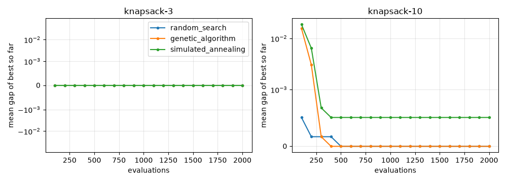
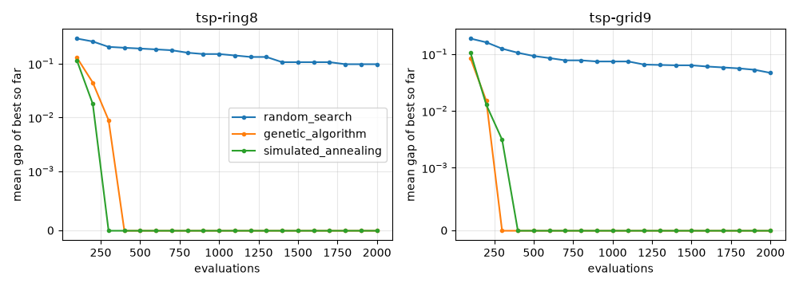
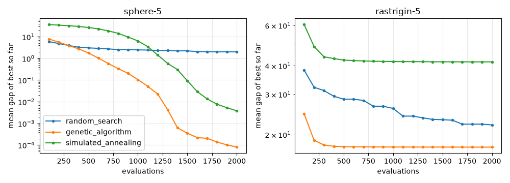

# Experiments

Evidence that the heuristics actually optimize, not just run: every
heuristic on every benchmark of the [suite](benchmarks.md), with the same
objective budget, over many seeds.

```sh
uv run python -m experiments.runner                      # results only
uv run --group experiments python -m experiments.report  # table + plots
```

`experiments/` lives outside the installable package. `runner.py` needs
only the library and writes `experiments/results/runs.csv` (one row per
run) and `summary.json` (aggregates and mean convergence curves);
`report.py` rewrites the table below and, if matplotlib (optional
`experiments` dependency group) is installed, the PNG plots.

## Protocol

- **Budget:** `max_evaluations(2000)` for every run, so heuristics are
  compared at equal objective cost. The GA checks `stop` once per
  generation and may overshoot by one generation; with a population of 10
  it lands exactly on 2000 here.
- **Seeds:** 20 per (benchmark, heuristic), `0..19`. The seed drives both
  the heuristic's `rng` and a private copy of the benchmark's `generate`
  stream (benchmarks seed theirs once at build time, so runs would
  otherwise share one stream).
- **Metrics:** final best value, `gap(benchmark, value)` (0 = optimal;
  absolute for the continuous optima at 0), success rate (final gap
  <= 1e-3), evaluation count, wall time, and the gap of the best-so-far
  at 20 evenly spaced evaluation counts (convergence curve). The curve is
  recorded by wrapping `evaluate`, so it is in evaluations for every
  heuristic regardless of the shape of `result.history`.

## Configurations

| Family | SA move / GA mutation | GA crossover | SA T0 |
|---|---|---|---|
| knapsack | `bit_flip_neighbor` | `single_point_crossover` | 50 |
| tsp | `two_opt_neighbor` | `pmx_single_point` | 1 |
| continuous | `gaussian_neighbor` (local, sigma 0.1, one coordinate, clipped) | `single_point_crossover` | 10 |

- **Random search** (local baseline in `experiments/runner.py`): fresh
  feasible solutions from `problem.generate` until the budget is spent.
- **Genetic algorithm:** library defaults (population 10; each generation
  breeds 10 children from repeatedly selected parent pairs, weighted
  selection, the best genome so far kept by elitism); the SA neighborhood
  is adapted as a mutation.
- **Simulated annealing:** geometric cooling from T0 to T0/1000 over the
  budget (one evaluation per iteration). T0 is set to the order of a
  typical worsening move for the family, not tuned per instance.

The library has no float operators, so `gaussian_neighbor` lives in
`experiments/` rather than expanding the package.

## Results

<!-- results:start -->

| Benchmark | Heuristic | Gap mean | Gap std | Gap min | Gap max | Best value | Success | Evals | Time (ms) |
|---|---|---|---|---|---|---|---|---|---|
| knapsack-3 | random_search | 0 | 0 | 0 | 0 | 220 | 100% | 2000 | 8.1 |
| knapsack-3 | genetic_algorithm | 0 | 0 | 0 | 0 | 220 | 100% | 2000 | 12.1 |
| knapsack-3 | simulated_annealing | 0 | 0 | 0 | 0 | 220 | 100% | 2000 | 4.8 |
| knapsack-10 | random_search | 0 | 0 | 0 | 0 | 295 | 100% | 2000 | 18.6 |
| knapsack-10 | genetic_algorithm | 0 | 0 | 0 | 0 | 295 | 100% | 2000 | 15.2 |
| knapsack-10 | simulated_annealing | 0.0005085 | 0.001617 | 0 | 0.00678 | 295 | 90% | 2000 | 6.4 |
| tsp-ring8 | random_search | 0.09723 | 0.08795 | 0 | 0.1768 | 8 | 45% | 2000 | 13.2 |
| tsp-ring8 | genetic_algorithm | 0 | 0 | 0 | 0 | 8 | 100% | 2000 | 21.0 |
| tsp-ring8 | simulated_annealing | 0 | 0 | 0 | 0 | 8 | 100% | 2000 | 12.5 |
| tsp-grid9 | random_search | 0.04663 | 0.05558 | 0 | 0.1502 | 9.414 | 55% | 2000 | 14.4 |
| tsp-grid9 | genetic_algorithm | 0 | 0 | 0 | 0 | 9.414 | 100% | 2000 | 21.0 |
| tsp-grid9 | simulated_annealing | 0 | 0 | 0 | 0 | 9.414 | 100% | 2000 | 13.2 |
| sphere-5 | random_search | 2 | 0.9487 | 0.5834 | 4.102 | 0.5834 | 0% | 2000 | 4.6 |
| sphere-5 | genetic_algorithm | 8.01e-05 | 5.965e-05 | 8.772e-06 | 0.0002457 | 8.772e-06 | 100% | 2000 | 13.4 |
| sphere-5 | simulated_annealing | 0.003816 | 0.001668 | 0.001932 | 0.007247 | 0.001932 | 0% | 2000 | 5.0 |
| rastrigin-5 | random_search | 22.04 | 3.987 | 11.93 | 27.22 | 11.93 | 0% | 2000 | 4.9 |
| rastrigin-5 | genetic_algorithm | 17.62 | 9.883 | 6.969 | 37.82 | 6.969 | 0% | 2000 | 12.4 |
| rastrigin-5 | simulated_annealing | 41.56 | 25.68 | 2.991 | 108.5 | 2.991 | 0% | 2000 | 5.7 |

<!-- results:end -->





## Findings

- **TSP: GA and SA both solve it.** Both reach the optimum in all 20 seeds
  on both instances, each within ~300-400 evaluations;
  random search is still 5-10% off on average after 2000.
- **Sphere: the GA wins** (mean gap ~8e-5, 100% success) over SA (~4e-3,
  0% success). Every generation mutates all 10 children with a 0.1 step
  and keeps the best, so the population drifts steadily downhill; SA
  spends its high-temperature first half wandering (its curve starts
  worst) and its fixed sigma of 0.1 is too coarse for the last steps.
- **Rastrigin: nobody gets near the optimum with this budget.** The GA has
  the best mean gap (~18 vs ~22 random, ~42 SA) but stalls after ~300
  evaluations: with only 10 genomes, elitism and fitness-weighted
  selection, the population collapses onto one basin within a few
  generations and 0.1 steps cannot leave it (premature convergence; its
  std ~10 reflects which basin each seed lands in). SA freezes in a local
  minimum for the same step-size reason, but is high-variance: its best
  seed (gap ~3) is the best overall.
- **The GA used to be ~random search.** Before #49 each generation kept
  only 2 parents + 2 children and refilled the other 6 of 10 genomes with
  fresh random ones, so most of the budget was random sampling (TSP gaps
  0.07 / 0.03, sphere gap 1.6, rastrigin 20). Breeding the whole
  population and scale-invariant selection weights (the old `max - v + 1`
  weights were nearly uniform on small-range continuous values) fixed it.
- **Knapsack does not discriminate.** `knapsack-3` has 8 packings and
  `knapsack-10` 1024, fewer than the budget, so random search is 100%
  successful. SA is sensitive to T0 here: a first run with T0 = 10 (below
  the item values, 4-120) trapped SA in local optima (40% / 20% success);
  T0 = 50 gives 100% / 90%. Harder instances are needed to say more.
- **Time:** every run takes a few to ~25 ms; the GA is the slowest per
  evaluation (selection runs once per parent pair, plus crossover and
  feasibility bookkeeping), SA the fastest.

## Known inconsistency

`metadata['termination']` is the `State` that met `stop` in the GA but the
string `'stop'` in SA. The runner normalizes both to `'stop'` (see the
`termination` column of `runs.csv`); library semantics are unchanged here.
